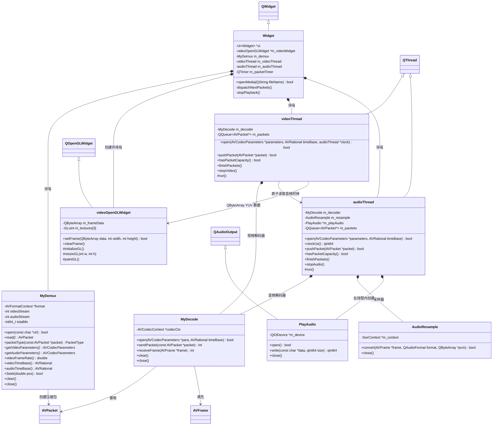
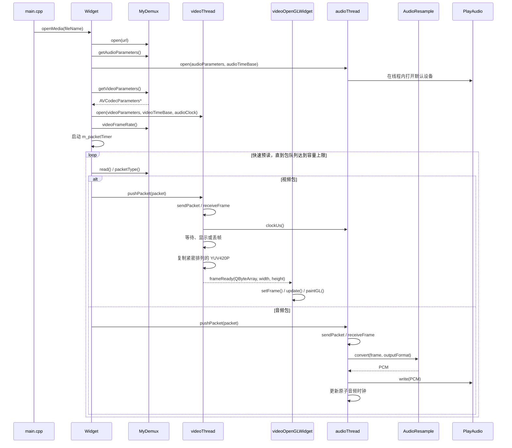

# MyPlay2 开发文档

## 1. 项目目标

MyPlay2 是一个基于 Qt、FFmpeg 和 OpenGL 的简化音视频播放器。`Widget` 负责解封装和分发数据包，音视频分别在线程中解码。音频设备播放进度作为主时钟，视频线程根据每帧 PTS 等待或丢帧，再交给 `videoOpenGLWidget` 渲染。

当前处理流程如下：

```text
媒体文件
  ↓
MyDemux 解封装
  ↓ AVPacket
  ├─ 视频 AVPacket → MyDecode → 比较视频 PTS 与音频时钟 → videoOpenGLWidget
  └─ 音频 AVPacket → MyDecode → AudioResample → PlayAudio → 发布音频时钟
```

## 2. 源文件说明

| 文件 | 作用 |
| --- | --- |
| `main.cpp` | 程序入口，配置 OpenGL、创建窗口并选择视频文件 |
| `widget.h/.cpp` | 播放流程控制层，连接解封装器、解码器和渲染控件 |
| `mydemux.h/.cpp` | FFmpeg 解封装封装类，读取媒体流和压缩数据包 |
| `mydecode.h/.cpp` | FFmpeg 解码封装类，将 `AVPacket` 解码为 `AVFrame` |
| `videothread.h/.cpp` | 视频工作线程和视频包队列，在线程中解码并复制 YUV420P |
| `audiothread.h/.cpp` | 音频工作线程和音频包队列，串联解码、重采样与播放 |
| `audioresample.h/.cpp` | 使用 libswresample 将解码音频转换为设备 PCM 格式 |
| `playaudio.h/.cpp` | 封装 Qt `QAudioOutput`，控制默认音频设备和 PCM 写入 |
| `videoopenglwidget.h/.cpp` | YUV420P 视频帧的 OpenGL 渲染控件 |
| `AUDIO_RESAMPLING_GUIDE.md` | 音频基础、重采样原理、FFmpeg API 与当前实现学习指南 |
| `widget.ui` | Qt Designer 生成的主窗口基础 UI |
| `MyPlay2.pro` | qmake 项目配置、源文件清单和 FFmpeg 链接配置 |

## 3. 类之间的关系



`Widget` 是整个播放器的协调者和唯一解封装入口。它将视频包、音频包分别转交给 `videoThread`、`audioThread` 的线程安全队列，避免两个线程同时从同一个 `AVFormatContext` 读取数据。

## 4. 播放时序



文件结束时，`Widget` 调用两个线程的 `finishPackets()`。线程在包队列清空后分别调用 `sendPacket(nullptr)`，取出仍缓存在解码器内部的延迟帧。

## 5. `MyDemux`：解封装类

### 职责

- 打开媒体文件或媒体 URL。
- 分析容器中的流信息。
- 找到最佳视频流和音频流。
- 逐个读取压缩的 `AVPacket`。
- 判断数据包属于视频、音频还是其他流。
- 提供创建解码器所需的 `AVCodecParameters`。

### `PacketType` 枚举

| 值 | 含义 |
| --- | --- |
| `Unknown` | 参数无效、解封装器未打开或流索引非法 |
| `Video` | 当前包属于所选视频流 |
| `Audio` | 当前包属于所选音频流 |
| `Other` | 字幕、附件或其他未处理的流 |

### 函数

#### `MyDemux()`

初始化 FFmpeg 网络模块。函数内部使用静态互斥锁和标志位，确保整个进程只调用一次 `avformat_network_init()`。

#### `~MyDemux()`

调用 `close()`，确保对象销毁时关闭媒体输入并释放 `AVFormatContext`。

#### `bool open(const char *url)`

打开媒体文件并分析流信息。

1. 验证 `url` 是否有效。
2. 关闭此前打开的媒体。
3. 调用 `avformat_open_input()` 创建输入上下文。
4. 调用 `avformat_find_stream_info()`读取流信息。
5. 使用 `av_find_best_stream()`选择视频流和音频流。
6. 保存媒体总时长。

没有找到视频流时返回 `false`。传入路径由 `Widget` 转换为 UTF-8，因此支持中文文件名。

#### `void close()`

调用 `avformat_close_input()` 关闭输入，并将视频流索引、音频流索引和总时长恢复为初始值。可以重复调用。

#### `void clear()`

调用 `avformat_flush()` 清理解封装器内部缓存，但不关闭媒体。通常在 seek 后或需要重新同步读取状态时使用。

#### `AVPacket *read()`

使用 `av_packet_alloc()` 创建数据包，再通过 `av_read_frame()` 读取下一个压缩包。

- 成功：返回新分配的 `AVPacket *`。
- 文件结束或读取失败：释放临时包并返回 `nullptr`。
- 所有权：调用者必须使用 `av_packet_free()` 释放返回的数据包。

当前实现用 `nullptr` 同时表示文件结束和读取错误，尚未区分这两种状态。

#### `PacketType packetType(const AVPacket *packet)`

比较 `packet->stream_index` 与当前选中的视频、音频流索引，并返回相应的 `PacketType`。

#### `AVCodecParameters *getVideoParameters()`

为当前视频流创建一份独立的 `AVCodecParameters` 副本。这样即使解封装器随后关闭，解码器仍可以安全使用参数。

返回值所有权交给调用者；当前调用者 `MyDecode::open()` 会在完成初始化后释放它。

#### `AVCodecParameters *getAudioParametes()`

旧接口，名称中保留了 `Parametes` 拼写错误，函数转发给 `getAudioParameters()`。

#### `AVCodecParameters *getAudioParameters()`

返回当前音频流编码参数的独立副本，供 `audioThread` 初始化其音频解码器。返回值由 `audioThread::open()` 接管，最终由 `MyDecode::open()` 释放。

#### `double videoFrameRate()`

调用 `av_guess_frame_rate()` 推测视频帧率，并转换为 `double`。无法确定帧率时返回 `0.0`。当前最终显示节奏以逐帧 PTS 为准，该接口保留用于帧率信息展示或没有时间戳时的扩展回退。

#### `AVRational videoTimeBase()` / `audioTimeBase()`

返回对应 `AVStream::time_base`。音频和视频的原始 PTS 只有结合各自时间基才能换算成实际时间；找不到对应流时返回无效时间基 `{0, 1}`。

#### `bool Seek(double pos)`

跳转到以秒为单位的 `pos`：

1. 清理解封装缓存。
2. 将秒转换到视频流的时间基。
3. 使用 `AVSEEK_FLAG_BACKWARD` 跳转到目标位置之前最近的关键帧。

调用 seek 后，控制层还应调用 `MyDecode::clear()` 清理解码器缓存，否则可能显示跳转前残留的帧。当前界面尚未接入 seek 控件。

## 6. `MyDecode`：解码类

### 职责

- 根据 `AVCodecParameters` 查找并创建 FFmpeg 解码器。
- 接收压缩的 `AVPacket`。
- 输出解码后的 `AVFrame`。
- 在 seek、切换文件和程序退出时清理状态。

### 函数

#### `MyDecode()`

创建空的解码对象。真正的解码器上下文由 `open()` 创建。

#### `~MyDecode()`

调用 `close()` 释放 `AVCodecContext`。

#### `bool open(AVCodecParameters *para, AVRational packetTimeBase)`

根据流参数初始化解码器：

1. 关闭旧解码器。
2. 使用 `codec_id` 查找解码器。
3. 分配 `AVCodecContext`。
4. 将流参数复制到解码上下文。
5. 设置解码线程数为 6。
6. 将流时间基写入 `AVCodecContext::pkt_timebase`，供 FFmpeg 推导帧时间戳。
7. 调用 `avcodec_open2()` 打开解码器。

该函数接管 `para` 的所有权，并在成功或失败路径中释放它。调用者传入后不应再次访问或释放该指针。

#### `int sendPacket(const AVPacket *packet)`

调用 `avcodec_send_packet()` 向解码器投递一个压缩包。

- 返回 `0`：包已接收。
- 返回 `AVERROR(EAGAIN)`：必须先调用 `receiveFrame()` 取走已有输出。
- 传入 `nullptr`：通知解码器输入结束并开始输出延迟帧。
- 其他负数：解码错误。

函数不会取得普通 `packet` 的所有权，调用者仍负责释放数据包。

#### `int receiveFrame(AVFrame *frame)`

调用 `avcodec_receive_frame()` 获取一个解码帧。

- 返回 `0`：成功获得一帧。
- 返回 `AVERROR(EAGAIN)`：当前没有完整帧，需要继续投递压缩包。
- 返回 `AVERROR_EOF`：解码器已经完全排空。
- 其他负数：解码错误。

`frame` 由调用者分配和释放。成功后，调用者在复用帧之前应调用 `av_frame_unref()`。

#### `void clear()`

调用 `avcodec_flush_buffers()` 清空解码器内部缓存。seek 后需要调用此函数，防止输出跳转之前的残留帧。

#### `void close()`

调用 `avcodec_free_context()` 释放解码上下文。函数可重复调用。

## 7. `videoThread`：视频工作线程

`videoThread` 继承 `QThread`，持有视频 `MyDecode` 和线程安全的 `AVPacket` 队列。视频解码从 GUI 线程迁移到 `run()` 后，`Widget` 不再直接参与 FFmpeg 的 send/receive 状态机。

### `bool open(AVCodecParameters *parameters, AVRational timeBase, const audioThread *audioClockSource)`

停止上一段视频线程、保存视频流时间基和音频时钟来源、打开视频解码器、重置退出和 EOF 状态并启动线程。函数接管 `parameters` 所有权。没有音频时可传入 `nullptr`，视频会使用自身 PTS 和 `QElapsedTimer` 调度。

### `bool pushPacket(AVPacket *packet)`

将视频包加入队列并唤醒线程。函数接管包所有权；线程停止或不再接收包时也会立即释放该包。

### `bool hasPacketCapacity()`

在线程锁保护下检查视频包队列是否少于 64 个。`Widget` 在容量耗尽时暂停解封装，消费后继续；有限预读既允许同步线程连续丢帧追赶，又避免内存无限增长。

### `void finishPackets()`

标记解封装输入已经结束。队列处理完成后，`run()` 向解码器发送空包，输出 B 帧等延迟帧。

### `void stopVideo()`

设置退出标志、唤醒条件变量、等待线程退出，然后释放队列中的包并关闭视频解码器。

### `void run()`

循环执行以下流程：

1. 优先调用 `receiveFrame()` 取走已有输出。
2. 返回 `EAGAIN` 时等待并取得下一个视频包。
3. 使用 `sendPacket()` 投递压缩包。
4. 使用 `best_effort_timestamp` 和视频时间基将 PTS 换算成微秒。
5. 调用 `synchronizeFrame()` 与音频时钟比较：视频早则分段等待，落后超过约一帧则丢帧。
6. 需要显示时调用 `copyYuv420pFrame()` 并发出 `frameReady()` 信号。
7. EOF 时排空解码器，退出时释放 `AVFrame`、队列和解码器。

### `SyncDecision synchronizeFrame(const AVFrame *frame)`

执行视频同步音频的核心策略。`videoPts - audioClock` 为正表示视频早了，线程每次最多等待 10 ms 后重新读取音频时钟；差值小于负的迟到阈值表示视频已经落后，当前帧直接丢弃。迟到阈值根据帧 `duration` 计算，并限制在 20~100 ms。

音频时钟不可用时，以第一帧视频 PTS 和 `QElapsedTimer` 建立回退时钟，保证无音频文件仍按正常速度播放。

### `bool copyYuv420pFrame(const AVFrame *frame, QByteArray *frameData)`

验证输入为 `AV_PIX_FMT_YUV420P`，再根据三个平面的 `linesize` 逐行复制数据，最终形成紧密排列的 `Y + U + V`。这一步在线程内完成，发给 GUI 的数据不再依赖解码器 `AVFrame` 的生命周期。

### `void frameReady(const QByteArray &frameData, int width, int height)`

跨线程视频帧信号。`QByteArray` 采用隐式共享，信号排队传输时只增加引用计数；GUI 收到后再交给 `videoOpenGLWidget`。

## 8. `videoOpenGLWidget`：视频渲染类

### 职责

- 接收 `videoThread` 已整理好的紧密 YUV420P 数据。
- 根据视频实际分辨率创建 Y、U、V 三张纹理。
- 将三个 YUV 平面上传到 GPU。
- 在片元着色器中把 YUV 转换成 RGB。
- 保持视频原始宽高比，未填满区域显示为黑边。

### 输入格式和内存布局

当前只接受 `AV_PIX_FMT_YUV420P`，即 8 位三平面格式：

| 平面 | `AVFrame` 指针 | 尺寸 |
| --- | --- | --- |
| Y | `data[0]` | `width × height` |
| U | `data[1]` | `ceil(width / 2) × ceil(height / 2)` |
| V | `data[2]` | `ceil(width / 2) × ceil(height / 2)` |

`AVFrame::linesize[]` 可能大于平面实际宽度，因为 FFmpeg 会进行内存对齐。该问题已由 `videoThread::copyYuv420pFrame()` 处理，渲染控件收到的数据中三个平面按 `Y + U + V` 紧密排列。

不能把 `AVFrame::data[]` 指针直接排队传给 GUI，因为视频线程会立即复用 `AVFrame`。因此跨线程传递的是拥有独立生命周期的 `QByteArray`。

### 公共函数

#### `videoOpenGLWidget(QWidget *parent)`

创建渲染控件，并设置最小显示尺寸为 320 × 180。构造阶段不会创建 OpenGL 资源，资源创建必须等到 Qt 建立 OpenGL 上下文后进行。

#### `~videoOpenGLWidget()`

调用 `cleanupOpenGL()` 删除着色器程序、纹理、VAO 和 VBO。

#### `bool setFrame(const QByteArray &frameData, int width, int height)`

接收一个解码帧：

1. 检查宽高和数据长度是否满足 YUV420P 布局。
2. 通过 `QByteArray` 隐式共享保存帧数据。
3. 更新缓存尺寸并将 `m_frameDirty` 设为 `true`。
4. 调用 `update()` 请求 Qt 在合适时间执行 `paintGL()`。

成功返回 `true`，尺寸或数据长度无效时返回 `false`。像素格式验证由 `videoThread` 完成。

#### `void clearFrame()`

清除 CPU 侧帧缓存和尺寸信息，并请求重绘。之后窗口只显示背景色，直到收到下一帧。

### OpenGL 生命周期函数

#### `void initializeGL()`

OpenGL 上下文创建完成后由 Qt 自动调用：

1. 初始化 OpenGL 3.3 函数。
2. 编译和链接着色器。
3. 创建覆盖画面的矩形顶点数据。
4. 创建纹理坐标数据。
5. 创建 VAO 和两个 VBO。
6. 将 Y、U、V sampler 绑定到纹理单元 0、1、2。

纹理没有在这里创建，因为此时可能还不知道视频分辨率。

#### `void resizeGL(int w, int h)`

窗口尺寸变化时由 Qt 自动调用，通过 `glViewport()` 更新 OpenGL 视口。

#### `void paintGL()`

每次需要刷新画面时由 Qt 自动调用：

1. 清除背景。
2. 调用 `uploadCurrentFrame()` 上传新帧。
3. 根据视频与控件的宽高比计算顶点缩放比例。
4. 绑定着色器、三张纹理和 VAO。
5. 使用 `GL_TRIANGLE_STRIP` 绘制矩形。

没有新帧时不会重复上传 CPU 数据，但会继续使用上一帧的 GPU 纹理绘制。

### 私有函数

#### `GLuint compileShader(GLenum type, const char *source)`

编译一个顶点或片元着色器。失败时读取 OpenGL 编译日志、删除无效 shader 并返回 `0`。

#### `bool createShaderProgram()`

分别编译顶点着色器和片元着色器，再链接为 OpenGL program。失败时输出链接日志并释放已创建资源。

#### `void ensureYuvTextures(int width, int height)`

确保 GPU 上存在与当前视频尺寸匹配的三张单通道纹理：

- Y 纹理尺寸为完整视频尺寸。
- U、V 纹理宽高均为视频的一半并向上取整。
- 内部格式使用 `GL_R8`，上传格式使用 `GL_RED`。
- 视频分辨率变化时删除旧纹理并重新创建。

#### `void uploadCurrentFrame()`

取得最新 CPU 帧缓存的隐式共享快照。如果 `m_frameDirty` 为 `true`，使用 `glTexSubImage2D()` 分别上传 Y、U、V 三个平面，然后清除 dirty 标志。

#### `void cleanupOpenGL()`

将控件上下文设为当前上下文，删除纹理、VBO、VAO 和 shader program，然后重置资源句柄。控件从未创建上下文时直接返回。

## 9. `PlayAudio`：音频设备播放类

Qt 5 中的 `QAudio` 是保存 `State`、`Error` 等枚举的命名空间，不能被继承。`PlayAudio` 因此继承真正执行声音输出的 `QAudioOutput`，这是用户要求中“继承 QAudio”的可编译等价实现。

### `PlayAudio(QObject *parent)`

选择默认音频输出设备，优先请求 48 kHz、双声道、16 位有符号小端 PCM；设备不支持时使用 `nearestFormat()` 返回的最接近格式。

### `bool open()`

设置约 200 ms 的输出缓冲区，调用 `QAudioOutput::start()` 取得 Push 模式 `QIODevice`。成功返回 `true`，没有有效设备或启动失败时返回 `false`。

### `qint64 write(const char *data, qint64 size)`

根据 `bytesFree()` 判断设备当前可写空间，只写入设备能够接收的部分。返回实际写入字节数；返回 `0` 表示缓冲暂满，返回负数表示参数或设备无效。

### `void close()`

停止 `QAudioOutput` 并清除内部 `QIODevice` 指针。`PlayAudio` 在 `audioThread::run()` 中创建、使用和销毁，避免跨线程调用 Qt 音频对象。

## 10. `AudioResample`：音频重采样类

`AudioResample` 使用 FFmpeg `libswresample`，将解码器输出的采样率、声道布局和采样格式统一转换成 `PlayAudio::format()` 要求的交错 PCM。

### `bool convert(const AVFrame *frame, const QAudioFormat &outputFormat, QByteArray *pcmData)`

1. 检查输入音频帧和样本数量。
2. 输入或输出格式发生变化时自动调用 `configure()` 重建 `SwrContext`。
3. 结合 `swr_get_delay()` 计算充足的输出样本空间。
4. 调用 `swr_convert()` 完成采样率、声道和样本格式转换。
5. 将有效 PCM 字节写入 `pcmData`。

### `bool configure(...)`

根据 `AVFrame::sample_rate`、`format`、`ch_layout` 和 Qt 输出格式调用 `swr_alloc_set_opts2()`，随后用 `swr_init()` 初始化重采样器。

### `bool matchesCurrentFormat(...)`

比较当前 `SwrContext` 的输入采样率、采样格式、声道布局，以及输出格式。完全一致时复用现有上下文。

### `AVSampleFormat toAvSampleFormat(const QAudioFormat &format)`

将 Qt PCM 格式映射为 FFmpeg packed sample format。目前支持 U8、S16、S32、FLT 和 DBL 小端格式。

### `void close()`

释放 `SwrContext` 和保存的输入声道布局，并重置所有格式缓存。

## 11. `audioThread`：音频工作线程

`audioThread` 继承 `QThread`。它持有 `MyDecode`、`AudioResample` 和 `PlayAudio`，并通过 `QQueue<AVPacket *>` 接收 `Widget` 分发的音频包。

### `bool open(AVCodecParameters *parameters, AVRational timeBase)`

停止上一段音频，保存音频流时间基、打开音频解码器、重置退出、EOF 和音频时钟状态，然后启动线程。函数接管 `parameters` 所有权。

### `qint64 clockUs() const`

通过原子变量返回声卡估计已经播放到的媒体时间，单位为微秒。`InvalidClockUs` 表示音频时钟尚未建立或已经停止；使用最小整数作为无效值，可以保留媒体中合法的负 PTS。视频线程只读该原子值，不会跨线程直接访问 `QAudioOutput`。

### `bool pushPacket(AVPacket *packet)`

将音频包放入线程安全队列并唤醒工作线程。函数无论成功失败都会接管并负责释放 `packet`，调用者不得再次使用该指针。

### `bool hasPacketCapacity()`

在线程锁保护下检查音频包队列是否少于 256 个。容量上限用于解封装背压，并保留足够音频预读以降低短时调度抖动导致的断音。

### `void finishPackets()`

通知工作线程解封装器已到达 EOF。队列清空后，`run()` 会向音频解码器发送一次空包以输出延迟帧。

### `void stopAudio()`

设置原子退出标志、唤醒等待条件、等待 `run()` 结束，然后清空队列并关闭重采样器和解码器。

### `void run()`

音频线程的主循环：

1. 在线程内创建并打开 `PlayAudio`。
2. 调用 `receiveFrame()` 优先取走解码器已有输出。
3. 没有输出时等待 `Widget` 投递音频包。
4. 调用 `sendPacket()` 投递压缩包。
5. 用音频帧 `best_effort_timestamp` 和时间基确定音频时间轴起点。
6. 将解码帧交给 `AudioResample::convert()`。
7. 调用 `writePcm()` 把 PCM 分段写入音频设备，并更新已提交字节数和音频时钟。
8. EOF 时 drain 解码器并等待设备缓冲播放完成；退出时在本线程销毁音频设备。

### `bool writePcm(const QByteArray &pcmData)`

循环调用 `PlayAudio::write()`，直到整块 PCM 写完或收到退出请求。设备缓冲区已满时等待 5 ms 再重试。每次写入或等待都会使用 `QAudioOutput::processedUSecs()` 刷新音频播放时钟，并限制时钟不能超过已提交 PCM 的末尾。

### `void clearPackets()`

对队列中尚未解码的所有 `AVPacket` 调用 `av_packet_free()`。

## 12. `Widget`：播放器控制类

### 职责

`Widget` 是播放管线的控制中心，负责对象生命周期、定时调度和数据包分发。它持有一个 `MyDemux`、`videoThread`、`audioThread` 和 `videoOpenGLWidget`，不再直接执行音视频解码。

### 函数

#### `Widget(QWidget *parent)`

1. 初始化 Designer UI。
2. 创建垂直布局和 `videoOpenGLWidget`。
3. 将 `videoThread::frameReady` 以队列连接方式连接到渲染控件。
4. 将高精度 `QTimer::timeout` 连接到 `dispatchNextPackets()`。

#### `~Widget()`

停止音视频线程、关闭解封装器，再释放 Designer UI。

#### `bool openMedia(const QString &fileName)`

打开并启动一个视频：

1. 调用 `stopPlayback()` 清理上一个文件。
2. 将 Qt 字符串转为 UTF-8 路径。
3. 使用 `MyDemux::open()` 打开媒体。
4. 取得音频编码参数和时间基并启动 `audioThread`；音频失败不阻止视频播放。
5. 取得视频编码参数和时间基，传入音频时钟来源并启动 `videoThread`。
6. 更新窗口标题，以 1 ms 周期启动快速投包定时器并立即分发第一批数据。

成功返回 `true`，打开或初始化解码器失败时返回 `false`。

#### `void dispatchNextPackets()`

定时器驱动的数据包分发函数：

1. 先检查音频和视频包队列容量，任一队列满时暂停本轮读取。
2. 循环调用 `MyDemux::read()`，单轮最多处理 256 个包。
3. 将音频包交给 `audioThread::pushPacket()`。
4. 将视频包交给 `videoThread::pushPacket()`。
5. 释放字幕等未处理的数据包。
6. 文件结束时停止定时器，并调用两个线程的 `finishPackets()`。

定时器只负责快速预读，播放节奏由视频 PTS 和音频时钟决定。单次调用最多检查 256 个包，以免解封装工作长时间占用 GUI 线程。

#### `void stopPlayback()`

停止数据包定时器，依次停止视频、音频线程，关闭解封装器并清除渲染画面。

### 成员关系

| 成员 | 所有权与生命周期 |
| --- | --- |
| `ui` | `Widget` 创建并在析构函数中删除 |
| `m_videoWidget` | 以 `Widget` 为 Qt parent，由 Qt 父子对象机制销毁 |
| `m_demux` | 值成员，生命周期与 `Widget` 相同 |
| `m_videoThread` | 值成员，内部持有视频解码器和视频包队列 |
| `m_audioThread` | 值成员，内部持有音频解码器、重采样器、播放设备和音频包队列 |
| `m_packetTimer` | 值成员，通过 Qt 事件循环快速分发数据包，队列容量实施背压 |

## 13. `main.cpp`：程序入口

`main()` 完成以下工作：

1. 在创建 `QApplication` 前请求 OpenGL 3.3 Core Profile。
2. 创建并显示 960 × 540 的 `Widget`。
3. 如果命令行带有文件路径，则直接打开该文件。
4. 如果没有命令行参数，则弹出视频文件选择框。
5. 打开失败时显示错误对话框。
6. 进入 Qt 事件循环。

命令行启动示例：

```powershell
.\MyPlay2.exe "D:\video\sample.mp4"
```

## 14. 关键对象的所有权

| 对象 | 创建位置 | 释放位置 |
| --- | --- | --- |
| `AVFormatContext` | `avformat_open_input()` | `MyDemux::close()` |
| 视频/音频 `AVCodecParameters` | `MyDemux` 参数接口 | 对应的 `MyDecode::open()` |
| `AVCodecContext` | `MyDecode::open()` | `MyDecode::close()` |
| 视频 `AVPacket` | `MyDemux::read()` | `videoThread::run()` 或 `clearPackets()` |
| 音频 `AVPacket` | `MyDemux::read()` | `audioThread::run()` 或 `clearPackets()` |
| 视频 `AVFrame` | `videoThread::run()` | 同一个 `run()` 退出前 |
| 音频 `AVFrame` | `audioThread::run()` | 同一个 `run()` 退出前 |
| 帧中的数据引用 | `MyDecode::receiveFrame()` | 对应线程处理完每帧后 `av_frame_unref()` |
| CPU YUV 副本 | `videoThread::copyYuv420pFrame()` | Qt 隐式共享引用全部释放后 |
| OpenGL 资源 | `initializeGL()` / `ensureYuvTextures()` | `cleanupOpenGL()` |
| `SwrContext` | `AudioResample::configure()` | `AudioResample::close()` |
| `QAudioOutput` / `PlayAudio` | `audioThread::run()` | 同一个 `run()` 退出前 |

## 15. 当前限制

- 只渲染 `AV_PIX_FMT_YUV420P`，不支持 NV12、YUV422P、YUV444P、RGB 和硬件帧。
- 片元着色器当前使用视频范围的 YUV 到 RGB 系数，未根据 `AVFrame::color_range` 和 `colorspace` 动态选择色彩矩阵。
- 已实现以音频设备播放进度为主时钟的视频等待/丢帧同步；尚未处理暂停、倍速和长期时钟漂移补偿。
- 音视频包队列以包数量限制容量，尚未按照总字节数实施更精确的背压。
- 音视频解码已经进入工作线程，但解封装仍由 GUI 定时器执行，网络流可能阻塞界面。
- GUI 投包节奏仍参考容器推测的平均帧率，视频最终显示时刻已经依据每帧 PTS 调度。
- 尚未实现暂停、继续、进度条、seek 后解码状态重置和循环播放。
- `MyDemux::read()` 目前无法区分正常 EOF 与读取错误。

## 16. 构建环境

当前项目配置使用：

- Qt 5.12.8 MinGW 64-bit
- C++11
- FFmpeg shared development package
- Qt Multimedia / `QAudioOutput`
- OpenGL 3.3 Core Profile

项目已把当前使用的 FFmpeg shared development package 放在 `third_party/ffmpeg`，默认直接使用该工程内相对路径，不需要在其他电脑上修改绝对路径。

工程中保留以下覆盖方式，便于临时测试另一套 FFmpeg：

1. 在 qmake 命令行中传入 `FFMPEG_ROOT`。
2. 复制 `config.pri.example` 为 `config.pri`，然后填写本机路径。`config.pri` 已加入 `.gitignore`。
3. 删除或移走工程内置依赖后，设置系统环境变量 `FFMPEG_ROOT`。

`FFMPEG_ROOT` 应指向同时包含 `include`、`lib` 和 `bin` 目录的 FFmpeg shared development package。例如使用命令行配置：

```powershell
D:\qt\5.12.8\mingw73_64\bin\qmake.exe D:\qt\code\MyPlay2\MyPlay2.pro -spec win32-g++ CONFIG+=debug FFMPEG_ROOT=D:/path/to/ffmpeg
D:\qt\Tools\mingw730_64\bin\mingw32-make.exe -j4
```

每次链接成功后，qmake 会把 `avformat-63.dll`、`avcodec-63.dll`、`avutil-61.dll` 和 `swresample-7.dll` 自动复制到当前的 `debug` 或 `release` 输出目录。因此运行时不需要再把 FFmpeg 的 `bin` 目录加入系统 `PATH`。Qt 自身的 DLL 仍由 Qt Creator 的运行环境或 `windeployqt` 负责部署。

工程没有带入 `ffmpeg.exe`、`ffplay.exe`、`ffprobe.exe` 和当前播放器未链接的滤镜等运行库。内置包的版本、内容和更新方法见 `third_party/ffmpeg/README.md`。当前 FFmpeg DLL 直接由普通 Git 管理，不要求克隆电脑安装 Git LFS。

## 17. 后续扩展建议

建议按照以下顺序继续开发：

1. 将解封装也移动到独立线程，并将现有按包数量背压升级为按字节数背压。
2. 增加暂停、继续和 seek；seek 后同时调用 `MyDemux::clear()` 与 `MyDecode::clear()`，并重置音视频时钟。
3. 为音频时钟增加设备延迟校准、长期漂移补偿和倍速播放支持。
4. 根据实际需要增加其他像素格式转换或对应的 OpenGL shader。
