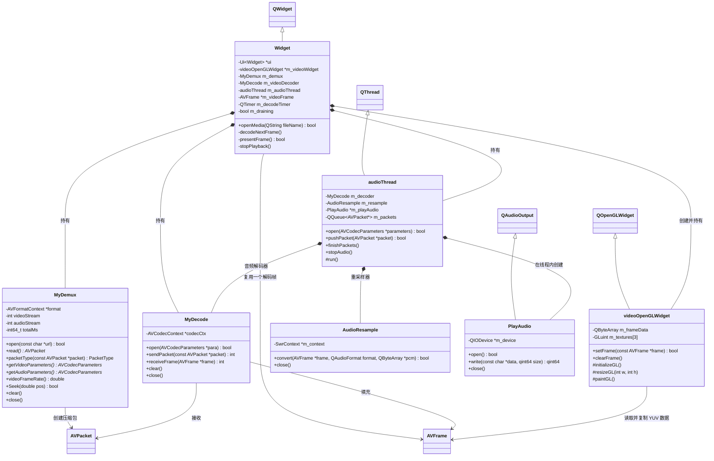
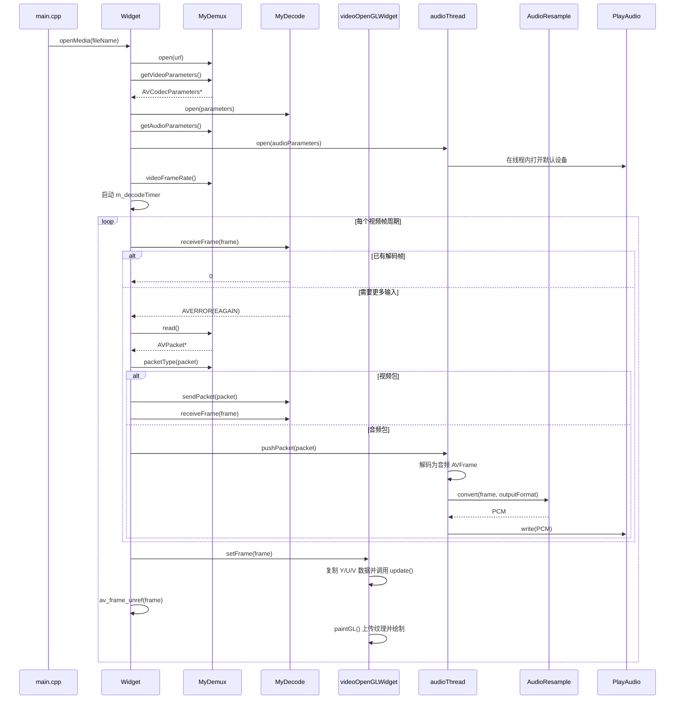

# MyPlay2 开发文档

## 1. 项目目标

MyPlay2 是一个基于 Qt、FFmpeg 和 OpenGL 的简化音视频播放器。视频由 GUI 定时器驱动解码并交给 `videoOpenGLWidget` 渲染；音频包由 `Widget` 分发给 `audioThread`，在线程内完成解码、重采样和设备播放。当前暂不处理音画同步。

当前处理流程如下：

```text
媒体文件
  ↓
MyDemux 解封装
  ↓ AVPacket
  ├─ 视频 AVPacket → MyDecode → YUV420P AVFrame → videoOpenGLWidget
  └─ 音频 AVPacket → audioThread → MyDecode → AudioResample → PlayAudio
```

## 2. 源文件说明

| 文件 | 作用 |
| --- | --- |
| `main.cpp` | 程序入口，配置 OpenGL、创建窗口并选择视频文件 |
| `widget.h/.cpp` | 播放流程控制层，连接解封装器、解码器和渲染控件 |
| `mydemux.h/.cpp` | FFmpeg 解封装封装类，读取媒体流和压缩数据包 |
| `mydecode.h/.cpp` | FFmpeg 解码封装类，将 `AVPacket` 解码为 `AVFrame` |
| `audiothread.h/.cpp` | 音频工作线程和音频包队列，串联解码、重采样与播放 |
| `audioresample.h/.cpp` | 使用 libswresample 将解码音频转换为设备 PCM 格式 |
| `playaudio.h/.cpp` | 封装 Qt `QAudioOutput`，控制默认音频设备和 PCM 写入 |
| `videoopenglwidget.h/.cpp` | YUV420P 视频帧的 OpenGL 渲染控件 |
| `widget.ui` | Qt Designer 生成的主窗口基础 UI |
| `MyPlay2.pro` | qmake 项目配置、源文件清单和 FFmpeg 链接配置 |

## 3. 类之间的关系



`Widget` 是整个播放器的协调者和唯一解封装入口。它将视频包交给视频解码器，将音频包转交给 `audioThread` 的线程安全队列，避免两个线程同时从同一个 `AVFormatContext` 读取数据。

## 4. 播放时序



文件结束时，`Widget` 调用 `sendPacket(nullptr)` 通知解码器进入 drain 状态，将 B 帧等仍缓存在解码器内部的延迟帧全部取出。

## 5. `MyDemux`：解封装类

### 职责

- 打开媒体文件或媒体 URL。
- 分析容器中的流信息。
- 找到最佳视频流和音频流。
- 逐个读取压缩的 `AVPacket`。
- 判断数据包属于视频、音频还是其他流。
- 提供创建解码器所需的 `AVCodecParameters`。

### `PacketType` 枚举

| 值 | 含义 |
| --- | --- |
| `Unknown` | 参数无效、解封装器未打开或流索引非法 |
| `Video` | 当前包属于所选视频流 |
| `Audio` | 当前包属于所选音频流 |
| `Other` | 字幕、附件或其他未处理的流 |

### 函数

#### `MyDemux()`

初始化 FFmpeg 网络模块。函数内部使用静态互斥锁和标志位，确保整个进程只调用一次 `avformat_network_init()`。

#### `~MyDemux()`

调用 `close()`，确保对象销毁时关闭媒体输入并释放 `AVFormatContext`。

#### `bool open(const char *url)`

打开媒体文件并分析流信息。

1. 验证 `url` 是否有效。
2. 关闭此前打开的媒体。
3. 调用 `avformat_open_input()` 创建输入上下文。
4. 调用 `avformat_find_stream_info()`读取流信息。
5. 使用 `av_find_best_stream()`选择视频流和音频流。
6. 保存媒体总时长。

没有找到视频流时返回 `false`。传入路径由 `Widget` 转换为 UTF-8，因此支持中文文件名。

#### `void close()`

调用 `avformat_close_input()` 关闭输入，并将视频流索引、音频流索引和总时长恢复为初始值。可以重复调用。

#### `void clear()`

调用 `avformat_flush()` 清理解封装器内部缓存，但不关闭媒体。通常在 seek 后或需要重新同步读取状态时使用。

#### `AVPacket *read()`

使用 `av_packet_alloc()` 创建数据包，再通过 `av_read_frame()` 读取下一个压缩包。

- 成功：返回新分配的 `AVPacket *`。
- 文件结束或读取失败：释放临时包并返回 `nullptr`。
- 所有权：调用者必须使用 `av_packet_free()` 释放返回的数据包。

当前实现用 `nullptr` 同时表示文件结束和读取错误，尚未区分这两种状态。

#### `PacketType packetType(const AVPacket *packet)`

比较 `packet->stream_index` 与当前选中的视频、音频流索引，并返回相应的 `PacketType`。

#### `AVCodecParameters *getVideoParameters()`

为当前视频流创建一份独立的 `AVCodecParameters` 副本。这样即使解封装器随后关闭，解码器仍可以安全使用参数。

返回值所有权交给调用者；当前调用者 `MyDecode::open()` 会在完成初始化后释放它。

#### `AVCodecParameters *getAudioParametes()`

旧接口，名称中保留了 `Parametes` 拼写错误，函数转发给 `getAudioParameters()`。

#### `AVCodecParameters *getAudioParameters()`

返回当前音频流编码参数的独立副本，供 `audioThread` 初始化其音频解码器。返回值由 `audioThread::open()` 接管，最终由 `MyDecode::open()` 释放。

#### `double videoFrameRate()`

调用 `av_guess_frame_rate()` 推测视频帧率，并转换为 `double`。无法确定帧率时返回 `0.0`，`Widget` 随后使用 33 ms 作为默认帧间隔。

#### `bool Seek(double pos)`

跳转到以秒为单位的 `pos`：

1. 清理解封装缓存。
2. 将秒转换到视频流的时间基。
3. 使用 `AVSEEK_FLAG_BACKWARD` 跳转到目标位置之前最近的关键帧。

调用 seek 后，控制层还应调用 `MyDecode::clear()` 清理解码器缓存，否则可能显示跳转前残留的帧。当前界面尚未接入 seek 控件。

## 6. `MyDecode`：解码类

### 职责

- 根据 `AVCodecParameters` 查找并创建 FFmpeg 解码器。
- 接收压缩的 `AVPacket`。
- 输出解码后的 `AVFrame`。
- 在 seek、切换文件和程序退出时清理状态。

### 函数

#### `MyDecode()`

创建空的解码对象。真正的解码器上下文由 `open()` 创建。

#### `~MyDecode()`

调用 `close()` 释放 `AVCodecContext`。

#### `bool open(AVCodecParameters *para)`

根据流参数初始化解码器：

1. 关闭旧解码器。
2. 使用 `codec_id` 查找解码器。
3. 分配 `AVCodecContext`。
4. 将流参数复制到解码上下文。
5. 设置解码线程数为 6。
6. 调用 `avcodec_open2()` 打开解码器。

该函数接管 `para` 的所有权，并在成功或失败路径中释放它。调用者传入后不应再次访问或释放该指针。

#### `int sendPacket(const AVPacket *packet)`

调用 `avcodec_send_packet()` 向解码器投递一个压缩包。

- 返回 `0`：包已接收。
- 返回 `AVERROR(EAGAIN)`：必须先调用 `receiveFrame()` 取走已有输出。
- 传入 `nullptr`：通知解码器输入结束并开始输出延迟帧。
- 其他负数：解码错误。

函数不会取得普通 `packet` 的所有权，调用者仍负责释放数据包。

#### `int receiveFrame(AVFrame *frame)`

调用 `avcodec_receive_frame()` 获取一个解码帧。

- 返回 `0`：成功获得一帧。
- 返回 `AVERROR(EAGAIN)`：当前没有完整帧，需要继续投递压缩包。
- 返回 `AVERROR_EOF`：解码器已经完全排空。
- 其他负数：解码错误。

`frame` 由调用者分配和释放。成功后，调用者在复用帧之前应调用 `av_frame_unref()`。

#### `void clear()`

调用 `avcodec_flush_buffers()` 清空解码器内部缓存。seek 后需要调用此函数，防止输出跳转之前的残留帧。

#### `void close()`

调用 `avcodec_free_context()` 释放解码上下文。函数可重复调用。

## 7. `videoOpenGLWidget`：视频渲染类

### 职责

- 接收并复制 YUV420P 格式的 `AVFrame`。
- 根据视频实际分辨率创建 Y、U、V 三张纹理。
- 将三个 YUV 平面上传到 GPU。
- 在片元着色器中把 YUV 转换成 RGB。
- 保持视频原始宽高比，未填满区域显示为黑边。

### 输入格式和内存布局

当前只接受 `AV_PIX_FMT_YUV420P`，即 8 位三平面格式：

| 平面 | `AVFrame` 指针 | 尺寸 |
| --- | --- | --- |
| Y | `data[0]` | `width × height` |
| U | `data[1]` | `ceil(width / 2) × ceil(height / 2)` |
| V | `data[2]` | `ceil(width / 2) × ceil(height / 2)` |

`AVFrame::linesize[]` 可能大于平面实际宽度，因为 FFmpeg 会进行内存对齐。因此 `setFrame()` 按行复制每个平面，跳过行尾填充，并在 `m_frameData` 中形成紧密排列的 `Y + U + V` 数据。

不能只保存 `data[0]`、`data[1]`、`data[2]` 指针，因为 `Widget::presentFrame()` 会在 `setFrame()` 返回后立即调用 `av_frame_unref()`，原始指针随即失效；而 Qt 的 `paintGL()` 是稍后执行的。

### 公共函数

#### `videoOpenGLWidget(QWidget *parent)`

创建渲染控件，并设置最小显示尺寸为 320 × 180。构造阶段不会创建 OpenGL 资源，资源创建必须等到 Qt 建立 OpenGL 上下文后进行。

#### `~videoOpenGLWidget()`

调用 `cleanupOpenGL()` 删除着色器程序、纹理、VAO 和 VBO。

#### `bool setFrame(const AVFrame *frame)`

接收一个解码帧：

1. 检查帧指针、尺寸和三个数据平面。
2. 检查格式是否为 `AV_PIX_FMT_YUV420P`。
3. 按 `linesize` 逐行复制 Y、U、V。
4. 更新缓存尺寸并将 `m_frameDirty` 设为 `true`。
5. 调用 `update()` 请求 Qt 在合适时间执行 `paintGL()`。

成功返回 `true`。其他像素格式会输出警告并返回 `false`，目前不会自动转换。

#### `void clearFrame()`

清除 CPU 侧帧缓存和尺寸信息，并请求重绘。之后窗口只显示背景色，直到收到下一帧。

### OpenGL 生命周期函数

#### `void initializeGL()`

OpenGL 上下文创建完成后由 Qt 自动调用：

1. 初始化 OpenGL 3.3 函数。
2. 编译和链接着色器。
3. 创建覆盖画面的矩形顶点数据。
4. 创建纹理坐标数据。
5. 创建 VAO 和两个 VBO。
6. 将 Y、U、V sampler 绑定到纹理单元 0、1、2。

纹理没有在这里创建，因为此时可能还不知道视频分辨率。

#### `void resizeGL(int w, int h)`

窗口尺寸变化时由 Qt 自动调用，通过 `glViewport()` 更新 OpenGL 视口。

#### `void paintGL()`

每次需要刷新画面时由 Qt 自动调用：

1. 清除背景。
2. 调用 `uploadCurrentFrame()` 上传新帧。
3. 根据视频与控件的宽高比计算顶点缩放比例。
4. 绑定着色器、三张纹理和 VAO。
5. 使用 `GL_TRIANGLE_STRIP` 绘制矩形。

没有新帧时不会重复上传 CPU 数据，但会继续使用上一帧的 GPU 纹理绘制。

### 私有函数

#### `GLuint compileShader(GLenum type, const char *source)`

编译一个顶点或片元着色器。失败时读取 OpenGL 编译日志、删除无效 shader 并返回 `0`。

#### `bool createShaderProgram()`

分别编译顶点着色器和片元着色器，再链接为 OpenGL program。失败时输出链接日志并释放已创建资源。

#### `void ensureYuvTextures(int width, int height)`

确保 GPU 上存在与当前视频尺寸匹配的三张单通道纹理：

- Y 纹理尺寸为完整视频尺寸。
- U、V 纹理宽高均为视频的一半并向上取整。
- 内部格式使用 `GL_R8`，上传格式使用 `GL_RED`。
- 视频分辨率变化时删除旧纹理并重新创建。

#### `void uploadCurrentFrame()`

取得最新 CPU 帧缓存的隐式共享快照。如果 `m_frameDirty` 为 `true`，使用 `glTexSubImage2D()` 分别上传 Y、U、V 三个平面，然后清除 dirty 标志。

#### `void cleanupOpenGL()`

将控件上下文设为当前上下文，删除纹理、VBO、VAO 和 shader program，然后重置资源句柄。控件从未创建上下文时直接返回。

## 8. `PlayAudio`：音频设备播放类

Qt 5 中的 `QAudio` 是保存 `State`、`Error` 等枚举的命名空间，不能被继承。`PlayAudio` 因此继承真正执行声音输出的 `QAudioOutput`，这是用户要求中“继承 QAudio”的可编译等价实现。

### `PlayAudio(QObject *parent)`

选择默认音频输出设备，优先请求 48 kHz、双声道、16 位有符号小端 PCM；设备不支持时使用 `nearestFormat()` 返回的最接近格式。

### `bool open()`

设置约 200 ms 的输出缓冲区，调用 `QAudioOutput::start()` 取得 Push 模式 `QIODevice`。成功返回 `true`，没有有效设备或启动失败时返回 `false`。

### `qint64 write(const char *data, qint64 size)`

根据 `bytesFree()` 判断设备当前可写空间，只写入设备能够接收的部分。返回实际写入字节数；返回 `0` 表示缓冲暂满，返回负数表示参数或设备无效。

### `void close()`

停止 `QAudioOutput` 并清除内部 `QIODevice` 指针。`PlayAudio` 在 `audioThread::run()` 中创建、使用和销毁，避免跨线程调用 Qt 音频对象。

## 9. `AudioResample`：音频重采样类

`AudioResample` 使用 FFmpeg `libswresample`，将解码器输出的采样率、声道布局和采样格式统一转换成 `PlayAudio::format()` 要求的交错 PCM。

### `bool convert(const AVFrame *frame, const QAudioFormat &outputFormat, QByteArray *pcmData)`

1. 检查输入音频帧和样本数量。
2. 输入或输出格式发生变化时自动调用 `configure()` 重建 `SwrContext`。
3. 结合 `swr_get_delay()` 计算充足的输出样本空间。
4. 调用 `swr_convert()` 完成采样率、声道和样本格式转换。
5. 将有效 PCM 字节写入 `pcmData`。

### `bool configure(...)`

根据 `AVFrame::sample_rate`、`format`、`ch_layout` 和 Qt 输出格式调用 `swr_alloc_set_opts2()`，随后用 `swr_init()` 初始化重采样器。

### `bool matchesCurrentFormat(...)`

比较当前 `SwrContext` 的输入采样率、采样格式、声道布局，以及输出格式。完全一致时复用现有上下文。

### `AVSampleFormat toAvSampleFormat(const QAudioFormat &format)`

将 Qt PCM 格式映射为 FFmpeg packed sample format。目前支持 U8、S16、S32、FLT 和 DBL 小端格式。

### `void close()`

释放 `SwrContext` 和保存的输入声道布局，并重置所有格式缓存。

## 10. `audioThread`：音频工作线程

`audioThread` 继承 `QThread`。它持有 `MyDecode`、`AudioResample` 和 `PlayAudio`，并通过 `QQueue<AVPacket *>` 接收 `Widget` 分发的音频包。

### `bool open(AVCodecParameters *parameters)`

停止上一段音频，打开音频解码器，重置退出和 EOF 状态，然后启动线程。函数接管 `parameters` 所有权。

### `bool pushPacket(AVPacket *packet)`

将音频包放入线程安全队列并唤醒工作线程。函数无论成功失败都会接管并负责释放 `packet`，调用者不得再次使用该指针。

### `void finishPackets()`

通知工作线程解封装器已到达 EOF。队列清空后，`run()` 会向音频解码器发送一次空包以输出延迟帧。

### `void stopAudio()`

设置原子退出标志、唤醒等待条件、等待 `run()` 结束，然后清空队列并关闭重采样器和解码器。

### `void run()`

音频线程的主循环：

1. 在线程内创建并打开 `PlayAudio`。
2. 调用 `receiveFrame()` 优先取走解码器已有输出。
3. 没有输出时等待 `Widget` 投递音频包。
4. 调用 `sendPacket()` 投递压缩包。
5. 将解码帧交给 `AudioResample::convert()`。
6. 调用 `writePcm()` 把 PCM 分段写入音频设备。
7. EOF 时 drain 解码器；退出时在本线程销毁音频设备。

### `bool writePcm(const QByteArray &pcmData)`

循环调用 `PlayAudio::write()`，直到整块 PCM 写完或收到退出请求。设备缓冲区已满时等待 5 ms 再重试。

### `void clearPackets()`

对队列中尚未解码的所有 `AVPacket` 调用 `av_packet_free()`。

## 11. `Widget`：播放器控制类

### 职责

`Widget` 是播放管线的控制中心，负责对象生命周期、定时调度和数据分发。它持有一个 `MyDemux`、视频 `MyDecode`、`audioThread`、可复用视频 `AVFrame` 和 `videoOpenGLWidget`。

### 函数

#### `Widget(QWidget *parent)`

1. 初始化 Designer UI。
2. 创建垂直布局和 `videoOpenGLWidget`。
3. 分配可重复使用的 `AVFrame`。
4. 将高精度 `QTimer::timeout` 连接到 `decodeNextFrame()`。

#### `~Widget()`

停止播放，释放 `AVFrame`，再释放 Designer UI。

#### `bool openMedia(const QString &fileName)`

打开并启动一个视频：

1. 调用 `stopPlayback()` 清理上一个文件。
2. 将 Qt 字符串转为 UTF-8 路径。
3. 使用 `MyDemux::open()` 打开媒体。
4. 取得视频编码参数并打开视频 `MyDecode`。
5. 取得音频编码参数并启动 `audioThread`；音频失败不阻止视频播放。
6. 读取视频帧率并计算定时器间隔。
7. 更新窗口标题、启动定时器并立即解码第一帧。

成功返回 `true`，打开或初始化解码器失败时返回 `false`。

#### `void decodeNextFrame()`

定时器驱动的核心解码函数：

1. 先调用 `receiveFrame()`，取走解码器中已经存在的输出。
2. 若返回 `EAGAIN`，循环读取媒体包。
3. 将音频包的所有权交给 `audioThread::pushPacket()`，丢弃其他未处理流。
4. 将视频包传给 `sendPacket()` 并释放包。
5. 再次调用 `receiveFrame()` 获取画面。
6. 得到画面后调用 `presentFrame()`。
7. 文件结束时分别通知视频解码器和音频线程进入 drain。

单次调用最多检查 256 个包，以免解封装工作长时间占用 GUI 线程。

#### `bool presentFrame()`

调用 `m_videoWidget->setFrame(m_videoFrame)`。渲染器完成数据复制后，立即调用 `av_frame_unref()` 释放当前帧引用，以便同一个 `AVFrame` 接收下一帧。

#### `void stopPlayback()`

停止视频定时器和音频线程、重置 drain 状态、清理当前 `AVFrame`、关闭解码器和解封装器，并清除渲染画面。

### 成员关系

| 成员 | 所有权与生命周期 |
| --- | --- |
| `ui` | `Widget` 创建并在析构函数中删除 |
| `m_videoWidget` | 以 `Widget` 为 Qt parent，由 Qt 父子对象机制销毁 |
| `m_demux` | 值成员，生命周期与 `Widget` 相同 |
| `m_videoDecoder` | 值成员，生命周期与 `Widget` 相同 |
| `m_audioThread` | 值成员，内部持有音频解码器、重采样器、播放设备和音频包队列 |
| `m_videoFrame` | 构造时 `av_frame_alloc()`，析构时 `av_frame_free()` |
| `m_decodeTimer` | 值成员，通过 Qt 事件循环驱动解码 |
| `m_draining` | 标记是否已经向解码器发送文件结束信号 |

## 12. `main.cpp`：程序入口

`main()` 完成以下工作：

1. 在创建 `QApplication` 前请求 OpenGL 3.3 Core Profile。
2. 创建并显示 960 × 540 的 `Widget`。
3. 如果命令行带有文件路径，则直接打开该文件。
4. 如果没有命令行参数，则弹出视频文件选择框。
5. 打开失败时显示错误对话框。
6. 进入 Qt 事件循环。

命令行启动示例：

```powershell
.\MyPlay2.exe "D:\video\sample.mp4"
```

## 13. 关键对象的所有权

| 对象 | 创建位置 | 释放位置 |
| --- | --- | --- |
| `AVFormatContext` | `avformat_open_input()` | `MyDemux::close()` |
| 视频/音频 `AVCodecParameters` | `MyDemux` 参数接口 | 对应的 `MyDecode::open()` |
| `AVCodecContext` | `MyDecode::open()` | `MyDecode::close()` |
| 视频 `AVPacket` | `MyDemux::read()` | `Widget::decodeNextFrame()` |
| 音频 `AVPacket` | `MyDemux::read()` | `audioThread::run()` 或 `clearPackets()` |
| 视频 `AVFrame` | `Widget` 构造函数 | `Widget` 析构函数 |
| 音频 `AVFrame` | `audioThread::run()` | 同一个 `run()` 退出前 |
| 帧中的数据引用 | `MyDecode::receiveFrame()` | 每次 `presentFrame()` 后 `av_frame_unref()` |
| CPU YUV 副本 | `videoOpenGLWidget::setFrame()` | 下一帧覆盖或 `clearFrame()` |
| OpenGL 资源 | `initializeGL()` / `ensureYuvTextures()` | `cleanupOpenGL()` |
| `SwrContext` | `AudioResample::configure()` | `AudioResample::close()` |
| `QAudioOutput` / `PlayAudio` | `audioThread::run()` | 同一个 `run()` 退出前 |

## 14. 当前限制

- 只渲染 `AV_PIX_FMT_YUV420P`，不支持 NV12、YUV422P、YUV444P、RGB 和硬件帧。
- 片元着色器当前使用视频范围的 YUV 到 RGB 系数，未根据 `AVFrame::color_range` 和 `colorspace` 动态选择色彩矩阵。
- 已实现音频播放，但尚未实现音画同步。
- 音频包队列当前没有容量上限。
- 解封装和解码仍在 GUI 线程中执行，处理高码率视频或网络流时可能阻塞界面。
- 播放节奏按照容器推测的平均帧率驱动，没有依据每帧 PTS 调度。
- 尚未实现暂停、继续、进度条、seek 后解码状态重置、循环播放和音画同步。
- `MyDemux::read()` 目前无法区分正常 EOF 与读取错误。

## 15. 构建环境

当前项目配置使用：

- Qt 5.12.8 MinGW 64-bit
- C++11
- FFmpeg shared development package
- Qt Multimedia / `QAudioOutput`
- OpenGL 3.3 Core Profile

`MyPlay2.pro` 中的 `FFMPEG_ROOT` 必须指向本机 FFmpeg 开发包目录。构建命令示例：

```powershell
D:\qt\5.12.8\mingw73_64\bin\qmake.exe D:\qt\code\MyPlay2\MyPlay2.pro -spec win32-g++ CONFIG+=debug
D:\qt\Tools\mingw730_64\bin\mingw32-make.exe -j4
```

运行时需要保证 Qt 和 FFmpeg 的 DLL 可以被系统找到。通过 Qt Creator 启动时通常会自动加入 Qt DLL 路径；FFmpeg 的 `bin` 目录需要加入运行环境的 `PATH`，或者将所需 DLL 部署到可执行文件目录。

## 16. 后续扩展建议

建议按照以下顺序继续开发：

1. 将解封装和解码移动到独立线程，通过有界帧队列把视频帧交给 GUI 线程。
2. 使用每帧 PTS 和流 `time_base` 进行播放调度。
3. 增加暂停、继续和 seek；seek 后同时调用 `MyDemux::clear()` 与 `MyDecode::clear()`。
4. 以音频设备播放时间作为主时钟实现音画同步。
5. 根据实际需要增加其他像素格式转换或对应的 OpenGL shader。
